# SunshineCTF 2026: Used Goods Of Tomorrow

## Premise

The objective of this web challenge was to purchase the "Founder's Vault Deed" item with lot number 4042 from the website. You can create an account, and each account starts with 500 credits with no way to gain more. The Founder's Vault Deed costs 1,000,000 credits.

## The API

After a cursory glance at the website in my browser, I checked the debugger to look at the scripts. One part that stood out was this from app.js:

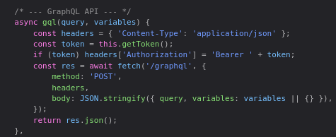

Using the JS console in the browser, I tested this out by searching for fields in the Query type, i.e., what I could query:

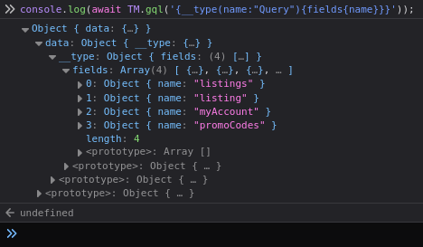

Of these results, myAccount and promoCodes seem promising.  
Digging deeper, I looked at what types exist:

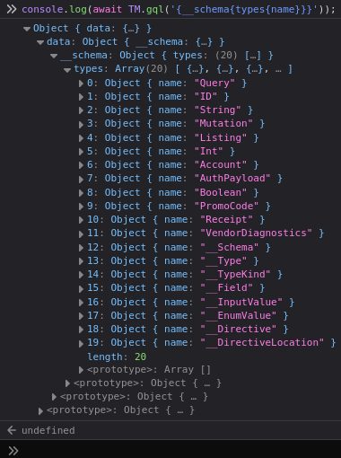

Some familiar results here are Listing, Account and PromoCode, which seem to match up to the queryable fields discovered earlier.  
The VendorDiagnostics type is also interesting, but there is no obvious way to query it

Looking deeper into the PromoCode type, I discover four fields:

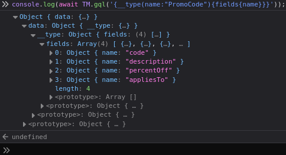

Attempting to query these fields returns this error:

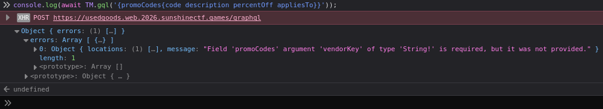

Given this, suspicion arises that vendorKey is a field of the VendorDiagnostics type I discovered earler, and checking this confirms it to be true:

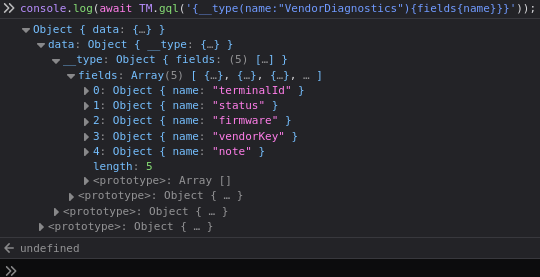

Looking into the fields of the other queryable types confirms that the VendorDiagnostics type is not queryable.  
At this point, using GraphQL's query operation seems to be a dead end for now, so I check what mutations exist to see if they contain anything promising:

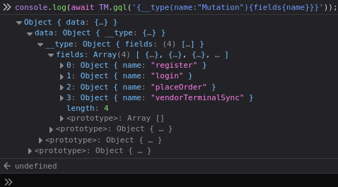

A welcome surprise is vendorTerminalSync, which could prove to be a solution to the apparent dead end from before.  
Calling this mutation and checking the type it returns reveals it returns an object with the VendorDiagnostics type:

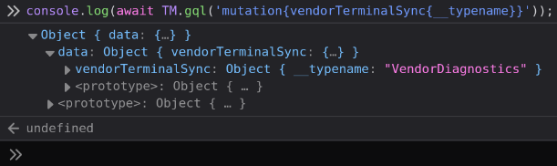

Then, checking the values of the fields in the VendorDiagnostics type from earlier, the vendorKey presents itself:

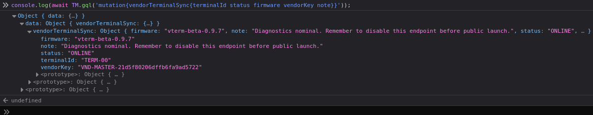

With the vendorKey, the promoCodes field becomes accessible:

The most interesting code here is FOUNDERS-100, which is gives 100% off on Lot #4042, the purchase of which is the objective of the challenge.

## The Flag

Checking out normally with the code FOUNDERS-100 presents us with the flag:

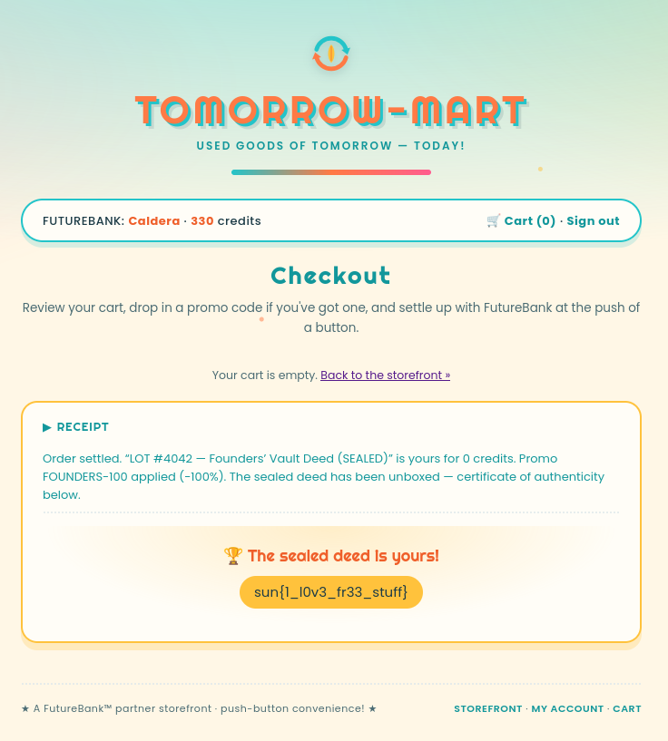

## N.B.

It is also possible to use the terminal to interact with the API rather than the java console:

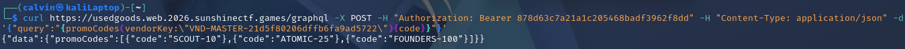

Notice the Authorization header, the existence and format of which can be discovered from the GraphQL API section of app.js (the first screenshot in this writeup). The token can be found in local storage.

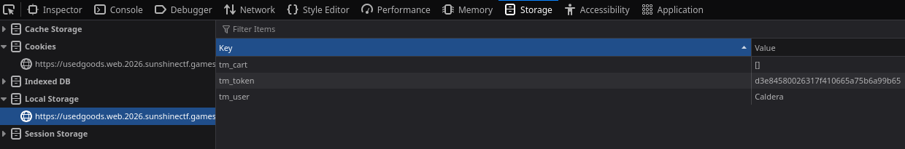