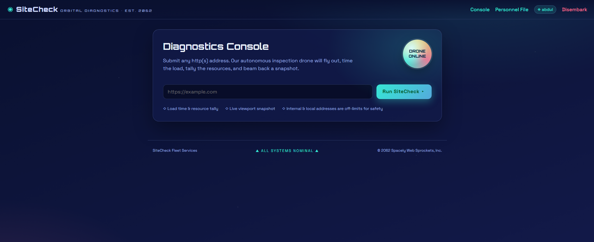
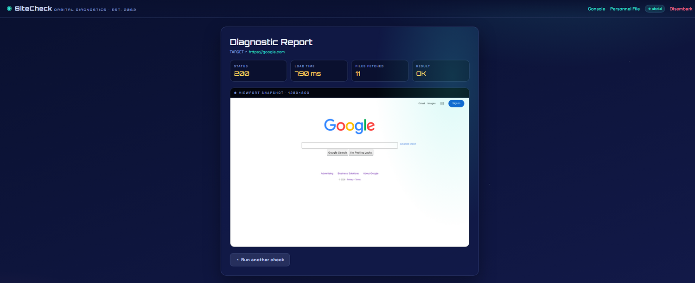
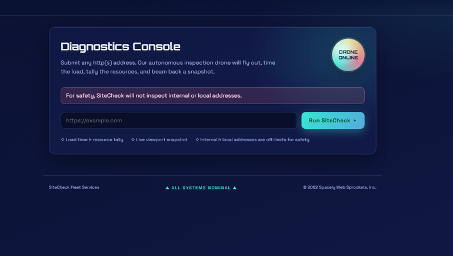
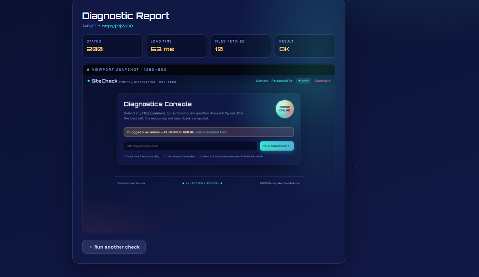
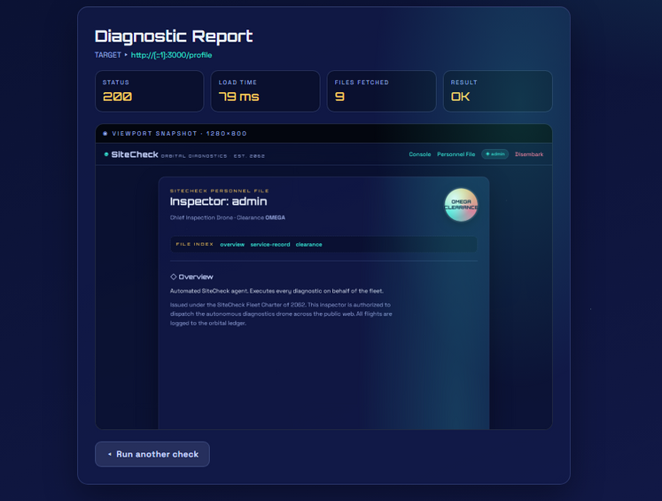
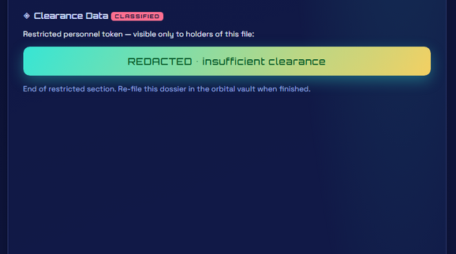
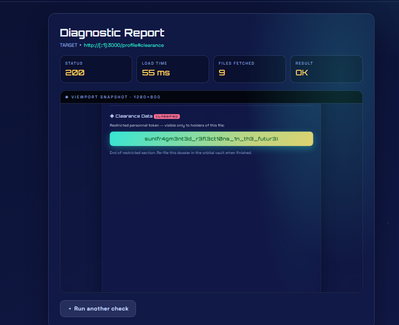

## Challenge
> Welcome to **SiteCheck**, the SkyCity fleet's favorite web-diagnostics service since 2062!

> Enlist for a free inspector account and put any website through its paces: our autonomous inspection drone flies out to the address you provide, clocks how long the page takes to load, tallies how many files it pulls down, and beams back a crisp viewport snapshot — all without you lifting a finger.

> Kick the tires on the future of web monitoring.

## Recon

After registering and logging in, we were presented with a URL inspection feature. The server visits the supplied URL, measures page load statistics, and returns a screenshot of the rendered page.

I first tested the functionality with `https://google.com`, which returned a screenshot of Google's homepage.

## Exploit
Since the application fetches arbitrary URLs, I tested for SSRF. Common localhost representations were blocked by the server-side validation:

- `http://127.0.0.1:3000`
- `http://0.0.0.0:3000`
- `http://2130706433:3000`
- `http://0x7f000001:3000`
- `http://0177.0.0.1:3000`

However, the IPv6 loopback address bypassed the filter:
`http://[::1]:3000`

From the navigation bar, I knew that the 'Personnel file' was in the `/profile` route.

So I submitted `http://[::1]:3000/profile`, and the server returned:

The goal now was to make the server scroll down before taking the screenshot. 
I visited the `/profile` from my browser and saw that there was part of the page with id=clearance, and it displayed the following:

So I submitted `http://[::1]:3000/profile` again but this time as ``http://[::1]:3000/profile#clearance`, and the server responded with the flag:

